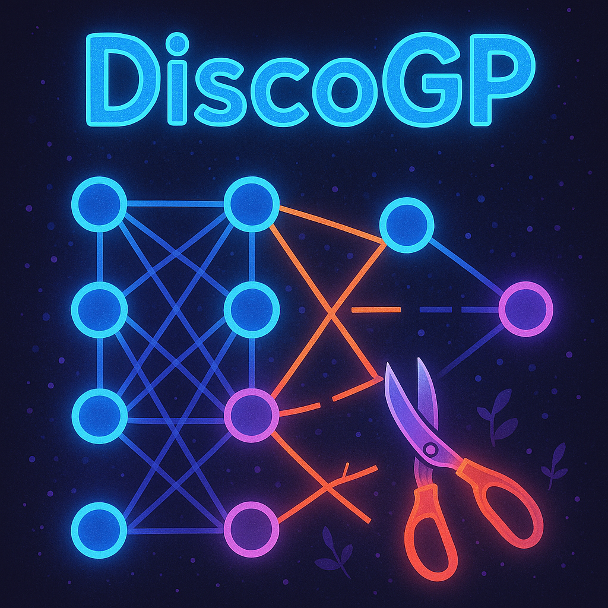

# DiscoGP: The Sheaf Discovery Framework

[](https://arxiv.org/abs/2407.03779)  
**Authors:** [Lei Yu](https://jadeleiyu.github.io/)\*, [Jingcheng Niu](https://frankniujc.github.io/)\*, [Zining Zhu](https://ecailab.org/), Xi Chen, and [Gerald Penn](https://www.cs.toronto.edu/~gpenn/).

<p align="center">
    
</p>

> **Abstract:** In this paper, we introduce DiscoGP, a novel framework for extracting self-contained modular units, or *sheaves*, within neural language models (LMs). These sheaves correspond to the models' impressive zero-shot performance across a variety of tasks. Our DiscoGP framework extends the concept of functional *circuits*, widely explored in interpretability research, by introducing *sheaves* — subsets of connection edges and weight parameters in an LM's computation graph — as interpretation units. Our framework identifies sheaves through a differentiable pruning algorithm that operates on both the computation graph's edge connections and the model's weight parameters. This process reduces the LM to a sparse skeleton while preserving its core capabilities. Experimental results demonstrate that across a range of linguistic and reasoning tasks, DiscoGP extracts sheaves that preserve 93-100% of the model's task performance while comprising only 1-7% of the original weights and connections. Furthermore, our analysis reveals that, compared to previously identified LM circuits, the sheaves discovered by DiscoGP exhibit superior modularity and functional fidelity. Extending our method to the neuron level also unveiled novel insights into the inner workings of LLMs.

## Running DiscoGP: Scripts and CLI

### Getting Started

First, set up your environment and install dependencies:

```bash
pip install -r requirements.txt
````

You can run DiscoGP in two equally simple ways: **(A) the minimal script** or **(B) the CLI**. They share the same workflow --- load a model, prepare data, evaluate a baseline, prune, and re-evaluate.

---

### A) Minimal script (`run.py`)

`run.py` is a **small, heavily commented example** that walks through the full pipeline with sensible defaults.

1. **Pick a task** (PARArel / IOI / BLiMP) in the script.
2. **Choose a model** (defaults to GPT-2; you can swap to Qwen or Llama).
3. **Run it**:

```bash
python run.py
```

This prints results at each stage and is the fastest way to understand and adapt the workflow.

---

### B) Command-line interface (`cli.py`)

Prefer not to edit a file? Use the CLI for the same workflow with one-liners:

* Choose a **task** and **pruning mode** (weights, edges, or both).
* The CLI loads **task-/mode-specific defaults** out of the box.
* You can optionally override any hyperparameters via flags if needed.

Examples:

```bash
# BLiMP with defaults (GPT-2)
python cli.py --task blimp --paradigm anaphor_gender_agreement

# PARArel with joint pruning and a specific data file
python cli.py --task pararel --modes we

# IOI with a different base model
python cli.py --task ioi --model Qwen/Qwen3-1.7B
```

> Tip: Run `python cli.py -h` to see available options. For most use cases, the built-in defaults are enough; add flags only when you want to tweak something.

---

### Notes

* Both entry points call the same underlying components (`DiscoGPTransformer`, configs, evaluation, pruning).
* Results and artifacts are saved under `./outputs` by default.
* Optional Weights & Biases logging can be toggled on/off via the CLI or in `run.py`.

## Supported Models

The maximum model capacities are evaluated on an 80G A100 GPU.

| Model      | Max Size | Status      |
|------------|:--------:|:-----------:|
| GPT-2      | XL       | ✅         |
| LLaMA-3.2  | 1B       | ✅         |
| Qwen3      | 1.7B     | ✅         |
| Gemma 2    | 1B       | In Progress |

### Coming Soon: Sheaf Visualization & Analysis

Alongside pruning and evaluation, DiscoGP will also provide tools for sheaf visualization and analysis. We are in the process of cleaning up the code.

## Acknowledgements

We thank Alireza Makou, Jonas Schulz, Tam Truong, and Xiaoyan Xue (TU Darmstadt) for their contribution to the code base, allowing DiscoGP to run on more tasks and model architectures.

## Citation

🎉 This paper is accepted to EMNLP 2025! We will update the ACL Anthology bib entry after the proceeding release.

```bibtex
@misc{yu2025discogp,
      title={Sheaf Discovery with Joint Computation Graph Pruning and Flexible Granularity}, 
      author={Lei Yu and Jingcheng Niu and Zining Zhu and Xi Chen and Gerald Penn},
      year={2025},
      eprint={2407.03779},
      archivePrefix={arXiv},
      primaryClass={cs.CL},
      url={https://arxiv.org/abs/2407.03779}, 
}
```